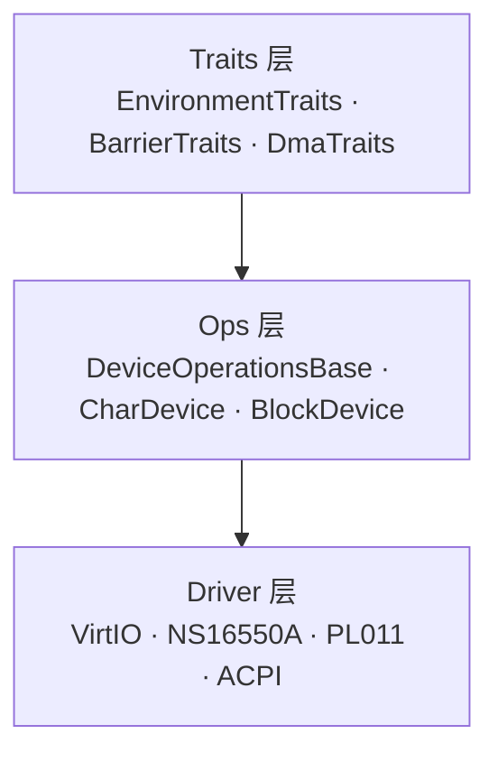

# device_framework

[English](README.md) | [中文](README_zh.md)

> **Header-only, Freestanding C++23 Device Framework**
>
> 统一的设备驱动框架，通过组合式 Traits 和 CRTP 实现零开销的设备抽象。VirtIO 块设备、UART、ACPI 等驱动均可开箱即用。

## ✨ 特性

- **Header-only** — 纯 `.hpp`，无需编译静态/动态库
- **Freestanding** — 不依赖 OS，bare-metal / OS kernel 均可使用
- **C++23** — 利用 Deducing this、concepts、`std::expected` 等实现零开销抽象
- **组合式 Traits** — 正交能力概念（Logging、Barrier、DMA），按需组合
- **统一 Ops 层** — `CharDevice` / `BlockDevice` 提供一致的 Open/Read/Write/Close 接口
- **多驱动族** — VirtIO（MMIO/PCI）、NS16550A、PL011、ACPI

## 📁 目录结构

```
include/device_framework/
├── defs.h                               # DeviceType 枚举
├── expected.hpp                         # ErrorCode、Expected<T>
├── traits.hpp                           # EnvironmentTraits, BarrierTraits, DmaTraits, NullTraits
│
├── ops/                                 # 设备操作抽象层
│   ├── device_ops_base.hpp              # DeviceOperationsBase<Derived>
│   ├── char_device.hpp                  # CharDevice<Derived>
│   └── block_device.hpp                 # BlockDevice<Derived>
│
└── driver/
    ├── virtio/                          # VirtIO 驱动族
    │   ├── traits.hpp                   # VirtioTraits = Env + Barrier + DMA
    │   ├── defs.h                       # DeviceId, ReservedFeature
    │   ├── transport/                   # 传输层 (MMIO, PCI)
    │   ├── virt_queue/                  # 虚拟队列 (Split)
    │   └── device/                      # 设备实现 (blk, net...)
    ├── ns16550a/                        # NS16550A UART
    │   ├── ns16550a.hpp                 # 底层驱动
    │   └── ns16550a_device.hpp          # CharDevice 适配器
    ├── pl011/                           # PL011 UART
    │   ├── pl011.hpp                    # 底层驱动
    │   └── pl011_device.hpp             # CharDevice 适配器
    └── acpi/                            # ACPI 表解析
        └── acpi.hpp

test/                                    # QEMU RISC-V 集成测试
```

## 🏗️ 架构

### 三层架构



### 组合式 Traits

不同驱动按需组合平台能力：

| 驱动族 | Traits 约束 | 要求 |
|--------|-----------|------|
| NS16550A / PL011 | `EnvironmentTraits` | 仅日志 |
| VirtIO | `VirtioTraits` | Log + Barrier + DMA |
| 未来 USB/NVMe | 自定义组合 | Log + DMA（或更多） |

```cpp
// 实现平台 Traits
struct MyTraits {
  static auto Log(const char* fmt, ...) -> int { /* ... */ }
  static auto Mb() -> void { asm volatile("fence" ::: "memory"); }
  static auto Rmb() -> void { asm volatile("fence ir,ir" ::: "memory"); }
  static auto Wmb() -> void { asm volatile("fence ow,ow" ::: "memory"); }
  static auto VirtToPhys(void* p) -> uintptr_t { return (uintptr_t)p; }
  static auto PhysToVirt(uintptr_t a) -> void* { return (void*)a; }
};

// MyTraits 同时满足 EnvironmentTraits、BarrierTraits、DmaTraits
// 可用于 VirtIO 驱动（VirtioTraits 约束）
// 也可用于 NS16550A（只要求 EnvironmentTraits）
```

## 🚀 快速开始

### 作为子模块

```bash
git submodule add https://github.com/MRNIU/device_framework.git
```

### CMake 集成

```cmake
add_subdirectory(device_framework)
target_link_libraries(your_target PRIVATE device_framework)
```

### 使用 NS16550A 字符设备

```cpp
#include "device_framework/driver/ns16550a/ns16550a_device.hpp"

device_framework::ns16550a::Ns16550aDevice uart(0x10000000);
uart.OpenReadWrite();
uart.PutChar('H');
uart.PutChar('i');
uart.Release();
```

### 使用 VirtIO 块设备

```cpp
#include "device_framework/driver/virtio/device/virtio_blk.hpp"

using BlkDev = device_framework::virtio::blk::VirtioBlk<MyTraits>;
auto blk = BlkDev::Init(mmio_base, ...);
```

## 🔨 构建与测试

```bash
mkdir build && cd build
cmake -DCMAKE_TOOLCHAIN_FILE=../test/riscv64-toolchain.cmake ..
make
make test_run    # QEMU 中运行测试
make test_debug  # GDB 调试模式
```

## 📜 许可证

MIT License — 详见 [LICENSE](LICENSE)
